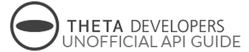

= http://theta360.guide[Unofficial Guides]
:icons: font
:toc: right
:toclevels: 1
:toc-title: Contents
:sectnums:

++++

++++

Send comments and corrections to <ricohtheta360@oppkey.com>

This is an unofficial, community-generated guide to using the RICOH THETA S API.
This is not authorized by RICOH and is based on publicly available information.

== http://theta360.guide/contest/[$45,000 THETA Dev Contest]

include::src/resources.adoc[]

include::src/testCommands.adoc[]

include::src/take_picture.adoc[]

include::src/testingWorkflow.adoc[]

include::python_tests.adoc[]

include::python_desktop.adoc[]

include::transfer.adoc[]

include::javascript.adoc[]

include::otherLang.adoc[]

include::rpi.adoc[]

include::hardware.adoc[]

include::network.adoc[]

include::usb.adoc[]

include::resources.adoc[]

include::hackathon_tips.adoc[]

include::thetapylib.adoc[]

include::nextsteps.adoc[]
