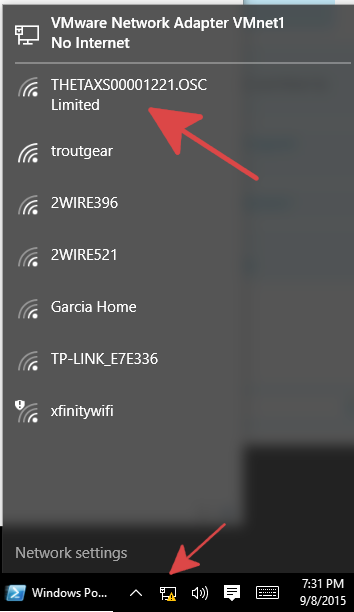
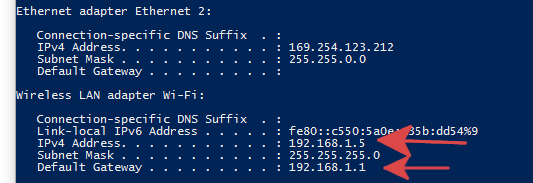

== Connect Computer to THETA S
Turn on the THETA S.  The WiFi icon will flash blue.

On your computer connect to the THETA access point that the camera
created.

On Windows 10, the network can be changed from the connection
icon in the lower right-hand corner.  If you are using WiFi for
Internet access, you will lose Internet access.  The camera
is at IP `192.168.1.1`.  This subnet may interfere with your
network access even if you have multiple network adapters.  If this happens
and you can't reach the THETA, disable all other network adapters.

On Windows 10, running `ipconfig` will show your configured network
adapters.

Your Wireless LAN must be in the subnet `192.168.1.x`.  The Default Gateway
must be `192.168.1.1`.  The gateway is the THETA S.

After establishing a wifi connection, please open a browser and access:

  http://192.168.1.1/osc/info

The response:

  {"manufacture":"RICOH",
    "model":"RICOH THETA S",
    "serialNumber":"00001054",
    "firmwareVersion":"01.00",
    "supportUrl":"https://theta360.com/en/support/",
    "endpoints":{
      ... THERE WILL BE MORE INFO
