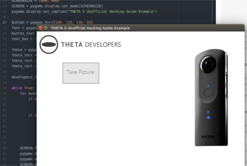

== Python

https://github.com/codetricity/theta-s-api-tests[Sample code]
is available on GitHub. Additional Python examples are also available
 from the community. A better https://github.com/hpd/OpenSphericalCamera[OSC Python library is available
 from Haarm-Pieter Duiker].
https://github.com/theta360developers/python-download-rossgoderer[Ulrich Rossgoderer wrote an example to download media from the command
line].

I am using the Python http://docs.python-requests.org/en/latest/[`requests`]
library for `HTTP` requests.  While you can use
https://docs.python.org/2/howto/urllib2.html[`urllib2`],
`requests` is easier for mere mortals.  Although I'm doing the testing
on Windows 10, I am running the python scripts in a VirtualBox VM with default
`NAT` network settings. The Python program is able to connect from the VM through
the Windows 10 WiFi adapter and to the THETA S. I'm assuming that Python
will work fine on Windows 10, but it's easier for me to use Linux.

To test with Python, I first started by simply writing out individual
commands in the script, similar to browser testing.  I then
moved the THETA API v2 commands into a library and wrote a command line
tool to accept arguments and test each command.

The first step to learn the API is to grab some basic information
from the camera and print it to your console.

  import requests, json, pprint

  def request(url_request):
      url_base = "http://192.168.1.1/osc/"
      url = url_base + url_request
      return url

  def basic_info():
      protocols = [
          "state",
          "info"
      ]
      for protocol in protocols:
          print(60 * "=")
          print(protocol + " - Testing RICOH THETA API v2\n")
          url = request(protocol)
          if protocol == "info":
              req = requests.get(url)
          else:
              req = requests.post(url)
          pprint.pprint(req.json())

  def main():
    basic_info()

  main()

This is what I get:

  ricoh@odapolis:~/Development/viewer$ python theta-python-test.py
  ============================================================
  state - Testing RICOH THETA API v2

  {u'fingerprint': u'FIG_0002',
   u'state': {u'_batteryState': u'disconnect',
              u'_captureStatus': u'idle',
              u'_latestFileUri': u'',
              u'_recordableTime': 0,
              u'_recordedTime': 0,
              u'batteryLevel': 0.67,
              u'sessionId': u'SID_0028',
              u'storageChanged': False}}
  ============================================================
  info - Testing RICOH THETA API v2

  {u'api': [u'/osc/info',
            u'/osc/state',
            u'/osc/checkForUpdates',
            u'/osc/commands/execute',
            u'/osc/commands/status'],
   u'endpoints': {u'httpPort': 80, u'httpUpdatesPort': 80},
   u'firmwareVersion': u'01.11',
   u'gps': False,
   u'gyro': False,
   u'manufacturer': u'RICOH',
   u'model': u'RICOH THETA S',
   u'serialNumber': u'00001221',
   u'supportUrl': u'https://theta360.com/en/support/',
   u'uptime': 3081}

Now, we want to take a picture. We'll take a still image in this example,
but it's almost as easy to start a video capture and end it.

First you need to start a session and
grab the session ID (SID).

  def startSession():
      url = request("commands/execute")
      body = json.dumps({"name": "camera.startSession",
           "parameters": {}
           })
      req = requests.post(url, data=body)
      response = req.json()
      print(60 * "=")
      print("startSession - Testing RICOH THETA API v2\n")
      pprint.pprint(response)
      sid = (response["results"]["sessionId"])
      print sid
      return sid

At this point I still think it's cool, to output the response to the console.
Also, it will give you a better idea of how to pull the `sessionId` or
`timeout` values into your program.  In the example above, I grab
the response from the request.  I then get the `results` key from the
dictionary.  The `results` value is another dictionary.  I use the
key `sessionId` to grab the value I need to take a picture.

My `main()` function now looks like this:

  def main():
      basic_info()
      sid = startSession() #grab session ID

The output of to the console looks like this:

  startSession - Testing RICOH THETA API v2

  {u'name': u'camera.startSession',
   u'results': {u'sessionId': u'SID_0029', u'timeout': 180},
   u'state': u'done'}
  SID_0029

Now, it's the exciting part.  We can take the picture!

  def takePicture(sid):
      url = request("commands/execute")
      body = json.dumps({"name": "camera.takePicture",
           "parameters": {
              "sessionId": sid
           }
           })
      req = requests.post(url, data=body)
      response = req.json()
      print(60 * "=")
      print("takePicture - Testing RICOH THETA API v2\n")
      pprint.pprint(response)

Add the function to `main()`.

  def main():
      basic_info()
      sid = startSession() #grab session ID
      takePicture(sid) #still image

Run it and celebrate!

  ============================================================
  takePicture - Testing RICOH THETA API v2

  {u'id': u'1',
   u'name': u'camera.takePicture',
   u'progress': {u'completion': 0.0},
   u'state': u'inProgress'}

In the next few sections, I'll show how easy it is to build
an interface to access the Python library we're building.

=== Python Desktop

This example uses the same Python code from the previous command line
example and runs it from a GUI.  The example uses http://www.pygame.org/download.shtml[Pygame]
due to the ease with which a GUI can be built. The application can
also be https://github.com/renpytom/rapt-pygame-example[modified to run on Android phones].
The source code is available on https://github.com/codetricity/theta-s-api-tests[GitHub].

Modify the code in the previous example to allow running as a library.

  if __name__ == '__main__':
      main()

The previous code is called `thetaPythonTest.py` and is in the same directory
as my new program.  The full program has two graphics purely for decoration.
You don't need those portions and can ignore them.

IMPORTANT: I've changed the library name to thetapylib.py, but I have not updated
the code example below.  Suggest you look at pyTHETA.py command line tool.
The older test library thetaPythonTest.py should still be there and work.
deskTHETA.py now has more examples to start and stop video capture.  I'll
try and get some of the file listing and transfer commands working with the
GUI prior to the Hackathon, but we're in crunch time.

==== Full Program
  import pygame, sys
  import requests
  import json
  from thetaPythonTest import startSession, takePicture

  WHITE = (255,255,255)
  GRAY = (230, 230, 230)
  GREEN = (100, 200, 50)
  DARK = (64, 64, 64)

  pygame.init()
  SCREENSIZE = (800, 600)
  SCREEN = pygame.display.set_mode(SCREENSIZE)

  button = pygame.Rect(100, 120, 140, 80)
  font = pygame.font.Font("fnt/Lato-Thin.ttf", 20)
  button_text = font.render("Take Picture", True, DARK)
  text_box = (button.left + 15, button.top + 23)

  theta = pygame.image.load("img/ricoh-theta-s.png")
  theta_rect = theta.get_rect()
  theta_rect.right = SCREENSIZE[0] - 50
  theta_rect.top = 60

  developers_logo = pygame.image.load("img/theta_developers.png")

  while True:
      for event in pygame.event.get():
          if event.type == pygame.QUIT:
              pygame.quit()
              sys.exit()
          if event.type == pygame.MOUSEBUTTONDOWN:
              mouse_pos = pygame.mouse.get_pos()
              if button.collidepoint(mouse_pos):
                  sid = startSession()
                  takePicture(sid)

      SCREEN.fill(WHITE)
      pygame.draw.rect(SCREEN,GRAY, button)
      pygame.draw.rect(SCREEN, DARK, button, 1)
      SCREEN.blit(button_text, text_box)
      SCREEN.blit(theta, theta_rect)
      SCREEN.blit(developers_logo, (10, 10))

      pygame.display.update()

==== Code Walkthrough

Import the `pygame` and `sys` libraries and set up a blank window.

  import pygame, sys

  pygame.init()
  SCREENSIZE = (800, 600)
  SCREEN = pygame.display.set_mode(SCREENSIZE)

  while True:
      for event in pygame.event.get():
          if event.type == pygame.QUIT:
              pygame.quit()
              sys.exit()
      pygame.display.update()

Load your fonts and colors above the main `while` loop.

  WHITE = (255,255,255)
  GRAY = (230, 230, 230)
  GREEN = (100, 200, 50)
  DARK = (64, 64, 64)
  font = pygame.font.Font("fnt/Lato-Thin.ttf", 20)

Build the button to press to take a picture.  This code also goes above
the main `while` loop.

  button = pygame.Rect(100, 120, 140, 80)
  button_text = font.render("Take Picture", True, DARK)
  text_box = (button.left + 15, button.top + 23)

Import your previous functions, close to the top of your program.

  from thetaPythonTest import startSession, takePicture

Draw the button inside of the main `while` loop above the `display.update`
statement.

  SCREEN.fill(WHITE)
  pygame.draw.rect(SCREEN,GRAY, button)
  pygame.draw.rect(SCREEN, DARK, button, 1)
  SCREEN.blit(button_text, text_box)

In the event queue loop, check for a button press. If there is a button
press, then start a new camera session and take the picture. The button press is
detected by first checking for an event `MOUSEBUTTONDOWN`.  If the mouse or
touchscreen is down, then get the position of the mouse or finger. If the
point of the mouse is inside of the button, then take the picture.

  if event.type == pygame.MOUSEBUTTONDOWN:
      mouse_pos = pygame.mouse.get_pos()
      if button.collidepoint(mouse_pos):
          sid = startSession()
          takePicture(sid)

=== Python File Transfer

Here's an example of getting the file from the camera to a computer
or Android phone.  There's easier ways to get the file from the camera,
but this method works with the `requests` library.

There are two main parts. First grab the latest file URI from the
camera.  The second part is to transfer the file over and save it to
`output.jpg`

Set up the URL base.

  def request(url_request):
      url_base = "http://192.168.1.1/osc/"
      url = url_base + url_request
      return url

Grab the state information from the camera.

  def state():
      url = request("state")
      req = requests.post(url)
      response = req.json()
      return response

Assuming that you've just taken a picture, the camera will have the
attribute `_latestFileUri`.  If you haven't taken a picture in
the session, take a picture now for this test.

  def latestFileUri():
      state_data = state()["state"]
      latestFileUri = state_data["_latestFileUri"]
      return latestFileUri

Once you know the URI, you can grab the file and write it to
your local storage.

  def getImage(fileUri):
      url = request("commands/execute")
      body = json.dumps({"name": "camera.getImage",
           "parameters": {
              "fileUri": fileUri,
  #            "_type": "thumb"
              "_type": "image"
           }
           })
      with open('output.jpg', 'wb') as handle:
          response = requests.post(url, data=body, stream=True)
          for block in response.iter_content(1024):
              handle.write(block)

==== Other Command Line Python Tools

* https://github.com/theta360developers/python-download-rossgoderer[Python script downloader]
from Ulrich Rossgoderer. Community.
