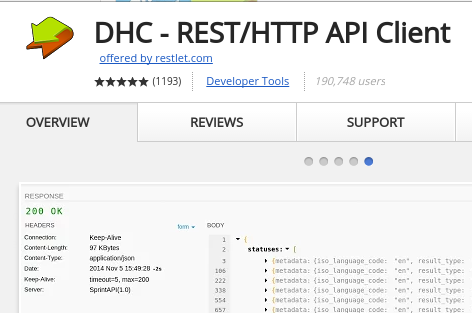
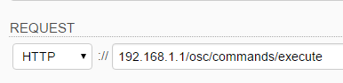
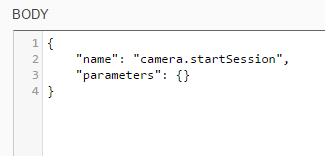

== Test Commands From Computer to Camera
You can use any tool to test `POST` and `GET` commands to the camera.
Many people use
link:http://curl.haxx.se/[curl], a web browser, or
link:https://www.getpostman.com/[Postman].  In this example, I
am using
link:https://chrome.google.com/webstore/detail/dhc-resthttp-api-client/aejoelaoggembcahagimdiliamlcdmfm?hl=en[DHC by Restlet].
It is available for free as a Chrome Extension.

`POST` to `http://192.168.1.1/osc/commands/execute`

Results:

  {
    "name": "camera.startSession",
    "state": "done",
    "results":{
      "sessionId": "SID_0001",
      "timeout": 180
    }
  }

Send a `POST` command to `/osc/state`.

  {
    "fingerprint": "FIG_0001",
    "state":{
      "sessionId": "SID_0000",
      "batteryLevel": 1,
      "storageChanged": false,
      "_captureStatus": "idle",
      "_recordedTime": 0,
      "_recordableTime": 0,
      "_latestFileUri": "",
      "_batteryState": "charged"
    }
  }

TIP: I have the camera plugged into a standalone charger capable supplying
1.5 amps.  The camera won't charge when plugged into the USB port
of most computers.

Read the
link:https://developers.theta360.com/en/docs/v2/api_reference/[API Reference on the RICOH]
site.
