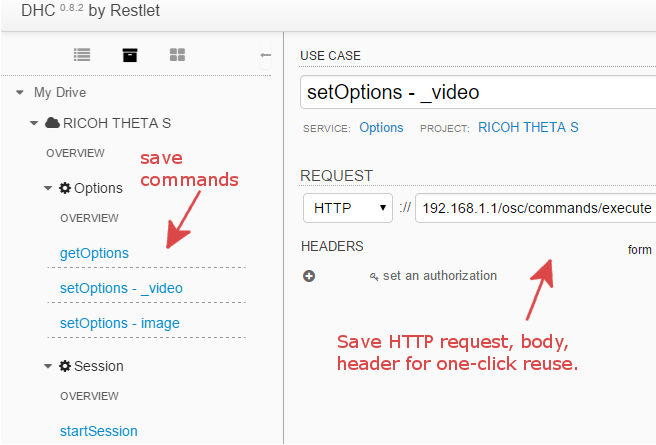

== Testing Workflow Using a HTTP Browser Tool

TIP: For quick testing, save the individual commands into your testing tool.

In this example, I've saved it into
link:http://restlet.com/products/dhc/[DHC by Restlet].

With this type of tool, you can quickly test indvidual commands and see the
results prior to running your program or test script.

NOTE: I have not been able to get a mock server running that supports the full
RICOH THETA API v2.  In my tests, I needed to connect to the actual device.  If you
build a functional mock server, send it to me. :-)
